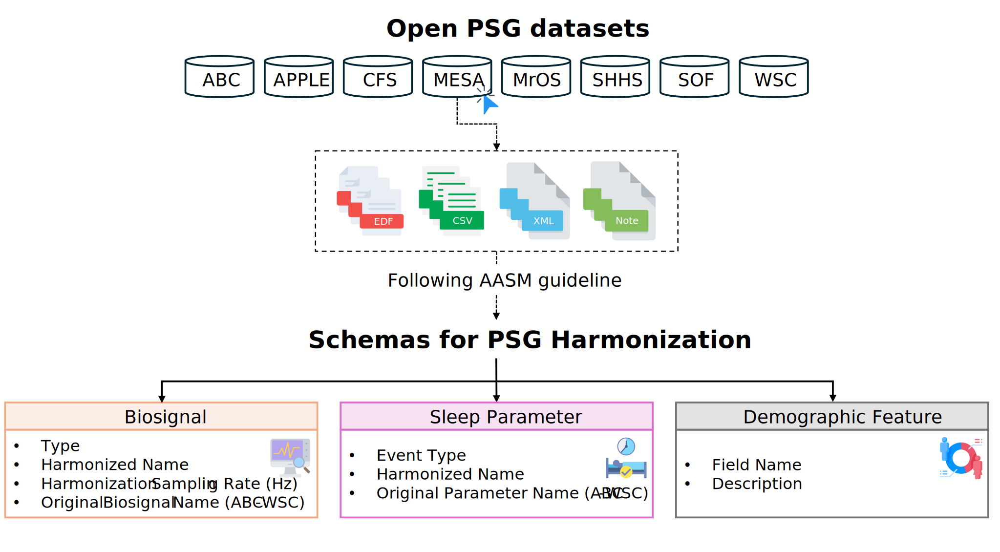
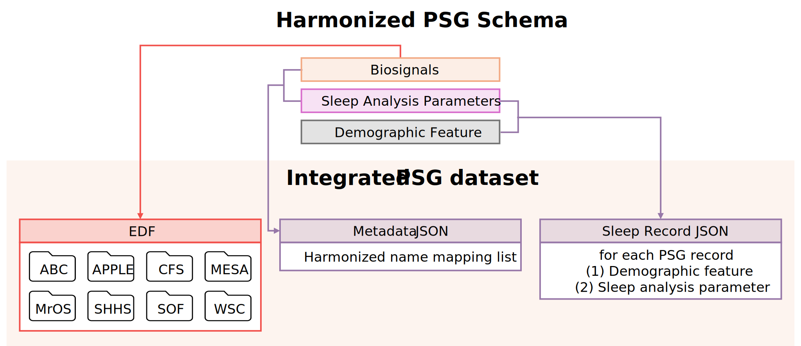

# Polysomnography harmonization schemes: A multi-institutional sleep research resource

Polysomnography (PSG) is the gold standard for diagnosing sleep disorders and records multiple biosignals during overnight monitoring. Public repositories such as the [National Sleep Research Resource (NSRR)](https://sleepdata.org/) have expanded access to large-scale PSG data, but differences in channel naming, sampling rates, and derived parameter definitions across datasets hinder reproducible multi-cohort analysis. This repository provides a **harmonized PSG schema** — with mapping tables and examples — for biosignals, sleep analysis parameters, and demographic characteristics across eight publicly available PSG cohorts.

## Contents

- [Polysomnography harmonization schemes: A multi-institutional sleep research resource](#polysomnography-harmonization-schemes-a-multi-institutional-sleep-research-resource)
  - [Contents](#contents)
  - [Overview](#overview)
  - [Repository layout](#repository-layout)
  - [Harmonization example (biosignals)](#harmonization-example-biosignals)
  - [Harmonization example (sleep parameters + demographics)](#harmonization-example-sleep-parameters--demographics)
  - [Data basis and access dates](#data-basis-and-access-dates)
    - [Data sources and references](#data-sources-and-references)
  - [1. Biosignal Schema](#1-biosignal-schema)
  - [2. Sleep Analysis Parameter Schema](#2-sleep-analysis-parameter-schema)
  - [3. Demographic Feature Schema](#3-demographic-feature-schema)
  - [License](#license)
  - [Citation](#citation)
  - [Acknowledgements](#acknowledgements)

## Overview

The **harmonized PSG schema** was developed by investigating the structure and content of European Data Format (EDF), eXtensible Markup Language (XML), comma-separated values (CSV), and documentation files from eight publicly available PSG datasets. Guided by American Academy of Sleep Medicine (AASM) clinical guidelines, we defined a unified schema encompassing biosignals, sleep analysis parameters, and demographic information.



Researchers developing sleep analysis algorithms (e.g., sleep stage classification, Apnea–Hypopnea Index (AHI) prediction) can follow these four steps to apply the proposed harmonized PSG schema:

1. **Define inputs and outputs** — Select input biosignals and output sleep parameters for your task.
2. **Check harmonized names** — Use the description workbooks ([biosignal](./harmonized/Biosignals_description.xlsx), [sleep analysis parameter](./harmonized/Sleep_description.xlsx), [demographic](./harmonized/Demographic_description.xlsx)).
3. **Map to dataset-specific labels** — Use the mapping workbooks ([biosignal](./harmonized/Biosignal_schema.xlsx), [sleep analysis parameter](./harmonized/Sleep_schema.xlsx), [demographic](./harmonized/Demographic_schema.xlsx)).
4. **Harmonize data and build a pipeline** — Align channel names and harmonization sampling rates, then construct preprocessing (see [examples](./examples/README.md)).



## Repository layout

```
harmonized/          # Published schema Excel files (mapping + descriptions)
images/              # Overview figures (SVG)
examples/            # EDF biosignal harmonization; tabular CSV harmonize
  harmonized_psg/    # Mapping and transform modules
  config/            # datasets.yaml (columns), nsrr_csv_sources.yaml (NSRR reference)
  run_biosignal_harmonize_example.py  # EDF biosignals → harmonized EDF
  run_harmonize_example.py       # Sleep parameters + demographics → JSON records
  merge_nsrr_csv.py  # Optional: NSRR split CSV exports → one wide CSV
output/              # Created on first run; user-generated JSON (gitignored)
```

Open PSG **EDFs and CSVs are not included**. Tabular harmonization writes Sleep Record JSON (JavaScript Object Notation, JSON). Provide your own cohort files and run the example scripts ([`examples/README.md`](./examples/README.md)).

## Harmonization example (biosignals)

Applies to all eight schema cohorts. Channel mappings and **harmonization sampling rates** are read from [`Biosignal_schema.xlsx`](./harmonized/Biosignal_schema.xlsx). The script renames channels, resamples each channel to its harmonization sampling rate, and writes a new EDF with **schema-mapped channels only**.

Run from the repository root. Download PSG EDF files from NSRR (not included here), then run:

```bash
pip install -r requirements.txt
python examples/run_biosignal_harmonize_example.py \
  --dataset abc \
  --input /path/to/source.edf \
  --output /path/to/work/abc_harmonized.edf
```

Batch mode: `--input-dir` and `--output-dir`. See [`examples/README.md`](./examples/README.md).

## Harmonization example (sleep parameters + demographics)

Applies to all eight schema cohorts (ABC, APPLE, CFS, MESA, MrOS, SHHS, SOF, WSC).

Provide **one wide CSV per cohort** — one row per sleep record, with columns for sleep analysis parameters and demographics (and optionally an EDF path). Map column names via [`config/datasets.yaml`](./examples/config/datasets.yaml), then harmonize with [`Sleep_schema.xlsx`](./harmonized/Sleep_schema.xlsx). Run from the repository root:

```bash
pip install -r requirements.txt

python examples/run_harmonize_example.py \
  --dataset abc \
  --csv /path/to/your/abc_cohort.csv
# Other cohorts: --dataset apple | cfs | mesa | shhs | sof | wsc | mros
```

Optional: place `{dataset}.csv` (or `{dataset}_merged.csv`) under one folder and set `USER_DATA_DIR` (see [`examples/README.md`](./examples/README.md)).

This produces integrated Sleep Record JSON as in the user-guide figure.

**NSRR note:** NSRR distributes tabular data as separate harmonized and dataset CSV exports. If your source is NSRR, merge those files first — see [`examples/README.md`](./examples/README.md#optional--nsrr-merging-split-csv-exports).

## Data basis and access dates

This harmonized schema was developed in alignment with AASM clinical guidelines.

For the eight cohorts used in this repository, data access dates were:

- **Seven cohorts** (ABC, APPLE, CFS, MESA, SHHS, SOF, WSC): accessed on **2024-04-22** for research use
- **MrOS**: additionally accessed on **2025-04-28** for research use

The schema and mapping examples reflect the files available at those access dates.

### Data sources and references

- National Sleep Research Resource (NSRR): [https://sleepdata.org/](https://sleepdata.org/)
- American Academy of Sleep Medicine (AASM). *The AASM Manual for the Scoring of Sleep and Associated Events*.

## 1. Biosignal Schema

The harmonized biosignal schema defines the classification (type), harmonized name, and harmonization sampling rate for a total of 59 biosignals.

Example:

| Type | Harmonized Name | Harmonization sampling rate (Hz) | ABC | APPLE | CFS | MESA | MrOS | SHHS | SOF | WSC |
|------|-----------------|----------------------|-----|-------|-----|------|------|------|-----|-----|
| EEG  | eeg_c3          | 100                  | C3  | –     | C3  | –    | C3   | –    | C3  | –   |
| EOG  | eog_loc         | 128                  | E1  | LOC   | LOC | EOG-L| LOC, E1 | EOG(L) | LOC | E1 |

See full table: [Biosignal_schema.xlsx](./harmonized/Biosignal_schema.xlsx)

See biosignal description: [Biosignals_description.xlsx](./harmonized/Biosignals_description.xlsx)

## 2. Sleep Analysis Parameter Schema

The harmonized sleep analysis parameter schema defines the event type classification and harmonized name for a total of 122 sleep analysis parameters.

Example:

| Event Type | Harmonized Name | ABC | APPLE | CFS | MESA | MrOS | SHHS | SOF | WSC |
|------------|-----------------|-----|-------|-----|------|------|------|-----|-----|
| Sleep      | waso            |     | nsrr_ttldurws_f1 | waso | nsrr_waso_f1 | powaso | nsrr_ttldurws_f1 | | waso |
| Respiratory| oa_idx          | oai_oa0u_f1t1 | oaindextstpsg | oai0p | oai0p5 | pooai0p | oai0p | oai0p | |

See full table: [Sleep_schema.xlsx](./harmonized/Sleep_schema.xlsx)

See sleep parameter description: [Sleep_description.xlsx](./harmonized/Sleep_description.xlsx)

## 3. Demographic Feature Schema

The demographic feature schema defines nine harmonized demographic features, each with a description in [Demographic_description.xlsx](./harmonized/Demographic_description.xlsx) and per-dataset CSV column names in [Demographic_schema.xlsx](./harmonized/Demographic_schema.xlsx).

## License

This repository is licensed under the [Apache License 2.0](./LICENSE).

## Citation

```text
Han, Y., Ryu, G., Kim, Y., & Shin, H. (2026). Harmonized PSG Schema (Version 1.0.0) [Computer software].
```

## Acknowledgements

This work was supported by the Ministry of Food and Drug Safety, Republic of Korea (No. RS-2023-00215716).
